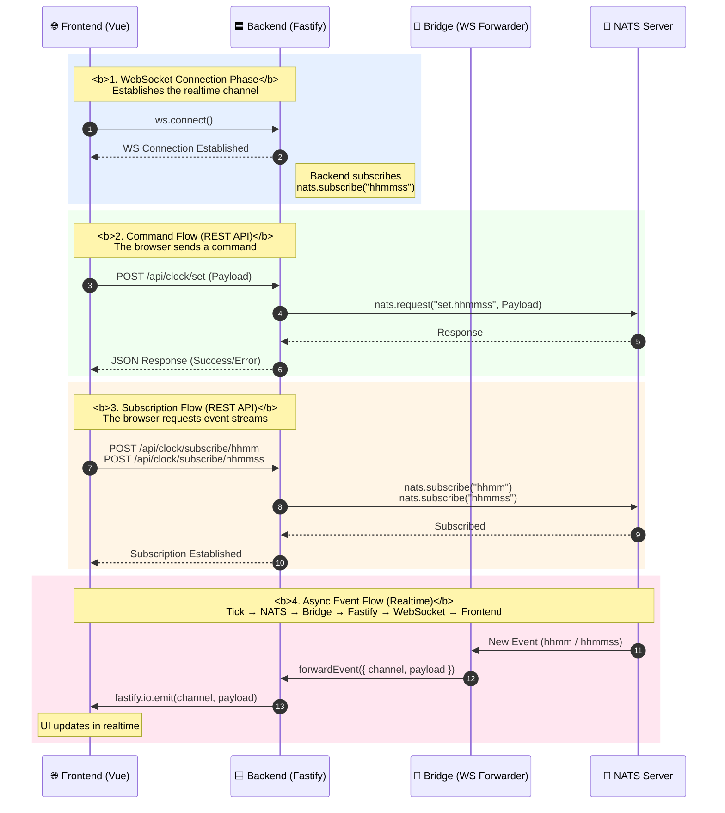
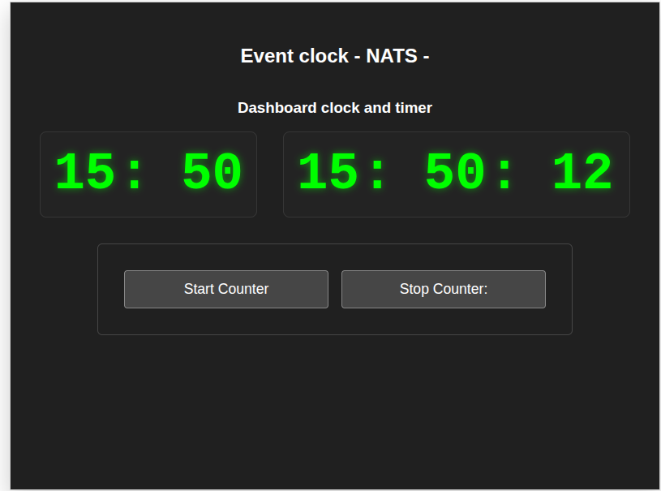
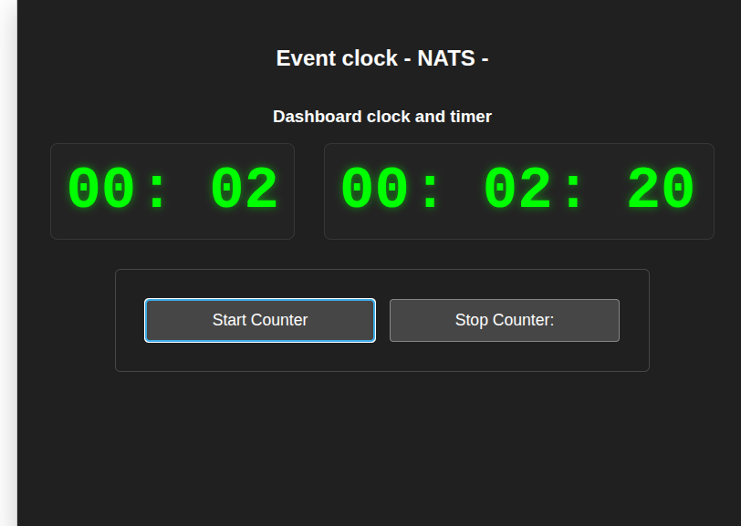

# **Web Event Clock**

A high‑performance, real‑time clock and timer system built using a **Gateway Architecture**.  
The project provides synchronized clock updates (`hhmm`, `hhmmss`) and stopwatch functionality while keeping the browser lightweight by offloading all NATS communication to a dedicated backend layer.

---

## 🎯 **Project Goal**

The purpose of this system is to deliver real‑time time signals and stopwatch events to the browser without exposing NATS directly to the frontend.

### Key principles

- **Browser‑safe:**  
  The frontend never connects to NATS (no TCP, no native NATS client).

- **Gateway Pattern:**  
  The Fastify backend acts as a bridge, translating REST and WebSocket events into NATS messages.

- **Scalable:**  
  The `time-publisher` service runs independently and can be scaled horizontally without affecting the API gateway.

---

## 🏗 **Architecture Overview**



---

## 📂 **Monorepo Structure**

This project is organized as a **pnpm workspace**:

- **apps/frontend** — Vue 3 + Vite UI  
- **apps/backend** — Fastify API Gateway + WebSocket Bridge  
- **apps/time-publisher** — Clock & timer publisher service  
- **packages/shared** — Shared TypeScript types, Zod schemas, constants  

---

## 📡 **Backend API**

The Backend exposes a clean set of REST endpoints used by the frontend to interact with the clock, timer, and NATS messaging system.

### **Health**

#### GET `/api/health`
Returns the health status of the API Gateway.

```json
{ "status": "ok" }
```

---

## **Clock API**

### POST `/api/set.clock`
Sets the clock value and forwards the request to NATS (`set.hhmmss`).

```json
{ "time": "2024-01-01T12:34:56Z" }
```

---

### POST `/api/subscribe/{channel}`
Subscribes the backend to a NATS time channel.

Channels:
- `hhmm`
- `hhmmss`

```json
{ "subscribed": "hhmm" }
```

---

### POST `/api/unsubscribe/{channel}`
Unsubscribes from a NATS time channel.

---

### POST `/api/publish/{channel}`
Publishes a custom event to a NATS channel.

---

## **Timer API**

### POST `/api/start.timer`
Starts the stopwatch.  
Triggers NATS event: `start.counter`.

### POST `/api/stop.timer`
Stops the stopwatch.  
Triggers NATS event: `stop.counter`.

### POST `/api/reset.timer`
Resets the stopwatch to zero.

---

# 🖼 **Screenshots**

## **Clock Running (hhmm / hhmmss events)**



---

## **Timer Running (relative hhmm / hhmmss starting from zero)**




---

## 🚀 **Getting Started**

### Prerequisites
- Node.js ≥ 20.19.0  
- pnpm  
- Docker & Docker Compose  

---

### Install dependencies

```bash
pnpm install
```

---

### Development mode

```bash
pnpm run dev
```

---

### Build all packages

```bash
pnpm run build
```

---

### Run with Docker Compose

```bash
docker-compose up --build
```

---

## 🛠 **Tech Stack**

- Vue 3, Vite, TypeScript  
- Fastify, Zod  
- NATS  
- Socket.IO  
- pnpm workspaces  
- Docker & Docker Compose  

---

## 🐳 **Dockerization**

Each application under `apps/` includes its own `Dockerfile`.

The root `docker-compose.yml` orchestrates:

- NATS server  
- Backend  
- Frontend  
- Time Publisher  

---

## 📜 **License**

MIT License.
